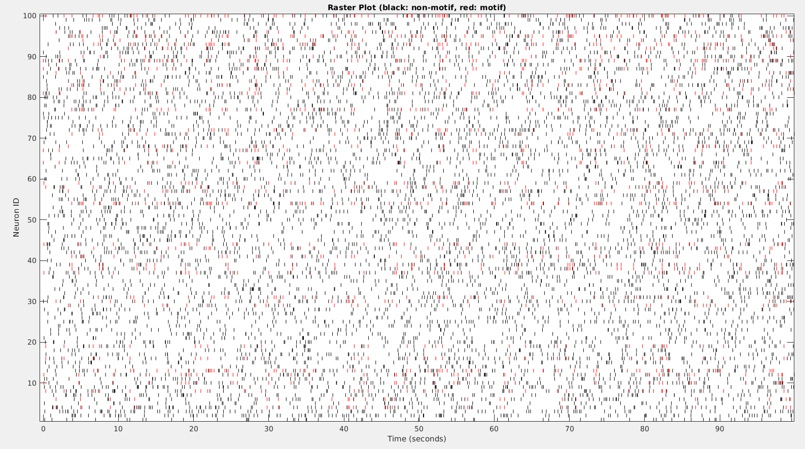
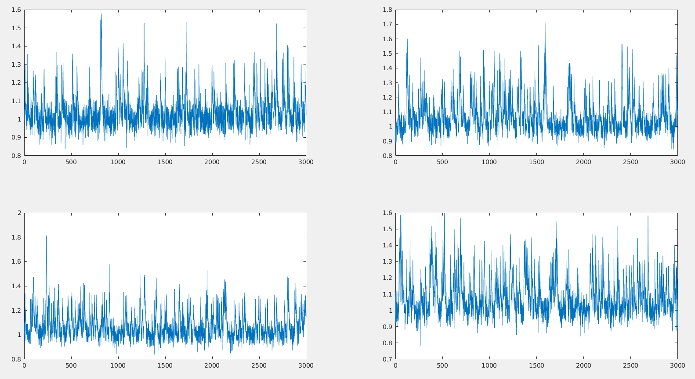

# CN2 Simulator

Computational Neuroscientists' Comprehensive Neuronal Simulator including 

* electrophysiological recording
* calcium imaging
* voltage imaging
* motif simulation

## Features

* Camera settings
  * recording time / frame rate / exposure time
  * Field of View
  * pixel size
* Various microscopy simulation
  * SPIM
  * XLFM
* Neuron physiological parameters
  * refractory period
  * photobleaching
  * protein expression rate
  * GECI
    * rise/decay time
    * dF/F0
* Recording proteins
  * GEVI/GECI
  * H2B(NLS), cytosolic, soma targeted, membrane targeted
* Various motif types
  * synchronous firing
  * sequentially firing
  * arbitrary pattern of firing
  * synchronous firing rate increase
  * sequential firing rate increase

## Applications

* benchmarks
  * computational microscopy
  * cell extraction
  * spike deconvolution
  * motif mining

## How to use

### For package use
- `pip install git+https://github.com/NICALab/CN2-Simulator.git`

### For development 

- Install dependencies through `conda env create -f environment.yml`.

- Activate the conda environment through `conda activate CN2Simulator`.

- Follow tutorials
  - Follow `tutorials/example.ipynb` to simulate neuron motif.
  - Follow `tutorials/imaging.py` to simulate calcium imaging.

- One can change `params.yaml` for different simulation settings.

- Check the data inside `\generated_data` folder.

- Visualize motifs with `SimulMotif/visualize.m`, which is a Matlab script.

## Figures

    
    

